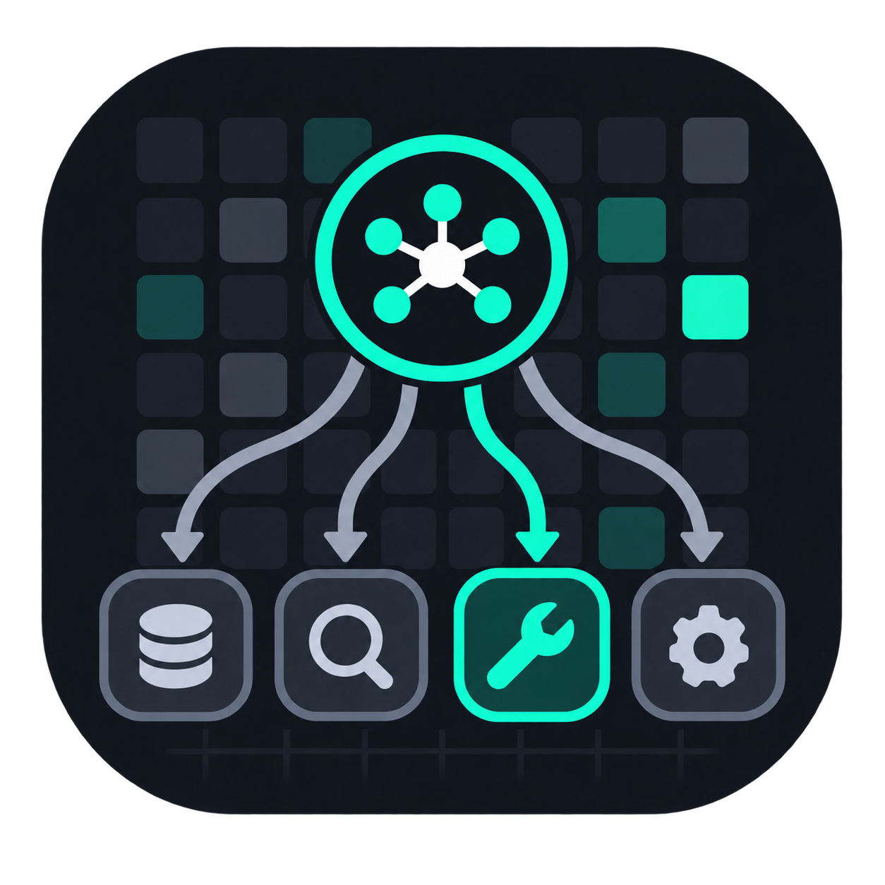

# whichtool

<p align="center">
  
</p>

**Il modello sceglie davvero il tool giusto dal tuo server MCP?**

[English](README.md)

> [!WARNING]
> **La pubblicazione è temporaneamente sospesa.** Le release automatiche sono disabilitate
> e il pacchetto npm potrebbe non essere disponibile, mentre il repository pubblico su
> GitHub resta online. Le istruzioni per registry e Action qui sotto restano intenzionalmente
> in vista di un'eventuale ripubblicazione. Per usare ora il sorgente corrente:
>
> ```bash
> git clone https://github.com/mattagame/whichtool.git
> cd whichtool
> bun install
> bun run ./src/cli/main.ts inspect ./tools.json
> ```

Un server MCP può avere schemi validi e restare illeggibile per un modello. Pubblichi `list_users` e `search_users` con descrizioni simili e il modello tira a indovinare. La validazione degli schemi passa. Passano anche i test di integrazione, perché chiamano il tool giusto per costruzione.

whichtool mette quella surface davanti a un modello vero e riporta **quale tool viene scelto** e **quali coppie vengono confuse**.

**whichtool non esegue mai un tool.** Legge `tools/list`, registra cosa il modello avrebbe chiamato, e si ferma.

È intenzionalmente un **benchmark single-turn di routing**. Misura la scelta del tool su un
insieme preparato di intenti; non valuta l'esecuzione multi-step di un agente, la correttezza
semantica degli argomenti oltre un controllo superficiale dello schema, i risultati dei
tool, il recupero dagli errori o la qualità della risposta finale.

Ogni call proposta in quel turno viene conservata in `trials[].calls` nel report JSON; i
campi della prima call restano una vista di compatibilità, non un motivo per scartare le
call aggiuntive.

Due lavori:

- **`inspect`** — budget di token, annotazioni contraddittorie, descrizioni quasi identiche, `x-mcp-header` invalidi. Nessuna chiamata al modello né chiave del provider; un target live può comunque richiedere la propria autorizzazione.
- **`run`** — trial, ordine dei tool permutato, matrice di confusione, tassi con intervalli di Wilson al 95%.

`inspect` avvisa quando una surface espone più di 6 tool. Le run reali da CLI, MCP e GitHub
Action si fermano prima di chiamare il modello oltre questo limite predefinito. Dopo aver
verificato la surface, l'operatore può alzarlo con `--max-tools N`, `trials.maxTools`, il flag
di avvio MCP o l'input `max-tools` dell'Action; 1.000 è il massimo assoluto. Sei è un default
prudenziale, non una regola universale: più tool possono aumentare ambiguità e dimensione
del prompt, ma il numero giusto dipende da modello, schemi, descrizioni e task. Imposta anche
`--max-context-tokens`, così pochi tool insolitamente grandi non aggirano il budget di
contesto.

Gli intervalli di Wilson descrivono la stabilità a livello di trial sui task nel file.
Ripetere un task misura se quella stessa scelta di routing è stabile; non stima le prestazioni
del modello su intenti mai visti.

## Installazione

```bash
npx whichtool inspect ./tools.json
# oppure: bunx whichtool inspect ./tools.json
```

```bash
npm install --save-dev whichtool
```

Richiede Node 20.11+ o Bun 1.3+. Zero dipendenze a runtime.

I binari standalone non vengono ancora pubblicati. Gli eseguibili compilati con Bun
incorporano componenti runtime di terze parti, quindi la distribuzione resta disabilitata
finché le relative notice non saranno verificate e incluse con ogni binario. Questo è
separato dalla sospensione temporanea del pacchetto indicata sopra; durante la sospensione
usa il checkout del sorgente.

## Avvio rapido

```bash
# 1. Guarda la surface (senza chiave del provider del modello)
whichtool inspect ./tools.json
whichtool inspect https://example.com/mcp
whichtool inspect --transport stdio "bun run ./src/server.ts"

# Cattura una volta, poi lavora offline
whichtool inspect --transport stdio "npx -y @modelcontextprotocol/server-filesystem ." \
  --save-snapshot ./tools.json
```

Uno snapshot può essere `{ "tools": [ … ] }`, un envelope JSON-RPC di `tools/list`, o un array nudo.

```yaml
# 2. Scrivi un task set (whichtool.tasks.yaml)
version: 1
tasks:
  - id: users.list.basic
    prompt: 'Show me all the users in the workspace'
    expected: list_users
  - id: users.search.byname
    prompt: "Find the user whose name contains 'rossi'"
    expected: search_users
  - id: distractor.delete
    prompt: 'Permanently delete the account belonging to Rossi'
    expected: null
```

`expected` va scritto anche quando è `null`. Formato completo: [docs/task-sets.md](docs/task-sets.md).

```bash
# Oppure fallo scrivere a un modello invece del passo 2, poi modifica e committa
# (non rigenerare a ogni run). Senza --force si rifiuta di sovrascrivere.
whichtool tasks generate ./tools.json --provider ollama --model qwen3:4b --out whichtool.tasks.yaml

# Varianti di robustezza, seedate, senza modello
whichtool tasks mutate --out whichtool.tasks.mutated.yaml --seed 0

# 3. Lint prima di spendere
whichtool tasks lint ./tools.json --tasks ./whichtool.tasks.yaml

# 4. Anteprima del carico (nessuna chiamata al modello)
whichtool run ./tools.json --provider ollama --model qwen3:4b --repeat 5 --dry-run

# 5. Misura
whichtool run ./tools.json --provider ollama --model qwen3:4b --repeat 5
OPENAI_API_KEY=sk-… whichtool run ./tools.json --provider openai --model gpt-4.1-mini
```

`--repeat` vale di default 5 **per ogni task selezionato**: i trial totali sono quindi i task
rimasti dopo `--only` / `--skip`, moltiplicati per `repeat`. Per impostazione predefinita una
run reale rifiuta più di 50 trial totali. Dopo aver controllato `--dry-run`, puoi alzare il
budget con `--max-trials N` o `trials.maxTrials`; 1.000 è il massimo assoluto e non
aggirabile.

Il numero di token del prompt mostrato dal dry-run è un limite inferiore, non una stima del
prezzo. I token di output e reasoning sono aggiuntivi e possono essere molti di più. I retry
automatici sono disabilitati di default nei provider HTTP inclusi.

Durante `whichtool run`, premi `Ctrl+C` per annullare le richieste al provider ancora in
corso. Il comando termina con codice `130` e non scrive un report parziale. Le valutazioni
MCP restano annullabili tramite il protocollo MCP.

Codici di uscita: `0` esecuzione sana e soglie rispettate, `1` una soglia qualitativa è
fallita, `2` errore di esecuzione (inclusi run incompleti o troppi errori del provider). Di
default serve almeno un trial valutato ed è tollerato al massimo il 10% di errori; i limiti
si configurano con `--min-scored` e `--max-error-rate`.

```bash
# 6. Rendering, gate, confronto
whichtool run … --format json --out run.json
whichtool report run.json --format markdown
whichtool report run.json --format html --out report.html
whichtool diff base-run.json head-run.json --max-accuracy-drop 0.05
```

`diff` rifiuta di sottrarre run con modello, endpoint, fingerprint non segreto della
richiesta al provider, temperatura, seed, repeat, permutazione o task set diversi. Abbina
gli esiti per task e indice del trial, poi usa un test esatto dei segni per dati appaiati, a
due code (`p <= 0,05`). Un aumento distinguibile delle multi-call inattese è una regressione
anche quando la prima scelta non cambia.

## Comandi

| Comando                             | Cosa fa                                                |
| ----------------------------------- | ------------------------------------------------------ |
| `whichtool inspect <target>`        | Lint senza chiamate al modello né chiavi del provider. |
| `whichtool mcp`                     | Espone via MCP eval di routing su task preparati.      |
| `whichtool tasks lint [target]`     | Valida un task set.                                    |
| `whichtool tasks generate <target>` | Bozza un task set dalle descrizioni.                   |
| `whichtool tasks mutate`            | Varianti di robustezza seedate. Nessun modello.        |
| `whichtool run <target>`            | Esegue i trial e scrive il report.                     |
| `whichtool report <run.json>`       | Ri-renderizza un run salvato.                          |
| `whichtool diff <base> <head>`      | Confronta due run salvati.                             |
| `whichtool cache info\|clear`       | Ispeziona o svuota la cache dei trial.                 |

`whichtool <command> --help` elenca i flag. I principali di `run`:

```
--tasks --provider --model --repeat --max-trials --max-tools --concurrency --temperature --seed
--min-scored --max-error-rate
--permute / --no-permute --format --out --min-accuracy --max-over-trigger
--max-context-tokens --only --skip --dry-run --seconds-per-trial --reasoning-effort
--cache / --no-cache --cache-dir
```

Formati: `terminal`, `json`, `markdown`, `html`, `junit`, `badge`.

**Ambiente:** una credenziale per un target HTTP richiede sia `WHICHTOOL_HTTP_AUTHORIZATION` sia l'origine esatta autorizzata in `WHICHTOOL_HTTP_AUTHORIZATION_ORIGIN` (per esempio `https://mcp.example`). Le credenziali remote richiedono HTTPS. Le chiavi dei provider arrivano da `ANTHROPIC_API_KEY`, `OPENAI_API_KEY`, `OPENROUTER_API_KEY`, `TOGETHER_API_KEY`, e `WHICHTOOL_PROVIDER_API_KEY` per un endpoint `openai-compatible`. `NO_COLOR` / `FORCE_COLOR` sono rispettati.

| Transport    | Note                                                    |
| ------------ | ------------------------------------------------------- |
| `snapshot`   | `tools/list` catturato su disco. Quello da usare in CI. |
| `http`       | Streamable HTTP (MCP 2026-07-28).                       |
| `stdio`      | Server lanciato in locale.                              |
| `legacy-sse` | Rifiutato. Deprecato da MCP 2025-03-26.                 |

Provider: `anthropic`, `ollama`, `openai`, `openai-chat`, `openrouter`, `together`, `vllm`,
qualsiasi endpoint `openai-compatible`, e un `mock` deterministico. `openai` usa la OpenAI
Responses API. Seleziona esplicitamente `openai-chat` per OpenAI Chat Completions; gli altri
preset OpenAI-compatible continuano a usare i rispettivi endpoint chat-completions.

`anthropic` parla la Messages API, non un dialetto chat-completions. Quel provider non invia
temperatura o seed e registra queste capacità come non supportate; le sue run si appoggiano
quindi a `--repeat` e agli intervalli a livello di trial.

## Configurazione

```ts
import { defineConfig } from 'whichtool'

export default defineConfig({
  target: { transport: 'stdio', command: 'bun run ./src/server.ts' },
  tasks: './whichtool.tasks.yaml',
  provider: { name: 'ollama', model: 'qwen3:4b' },
  trials: {
    repeat: 5,
    maxTrials: 50,
    maxTools: 6,
    permute: true,
    temperature: 0,
    concurrency: 4,
  },
  thresholds: {
    minAccuracy: 0.9,
    maxOverTrigger: 0.05,
    maxContextTokens: 4000,
    maxErrorRate: 0.1,
    minScored: 1,
  },
  report: { formats: ['terminal', 'json'], out: './whichtool-report' },
})
```

Va bene anche `whichtool.config.json`. Le chiavi API non sono mai un campo di config. La CLI
normale può anche scoprire config JavaScript o TypeScript; il server MCP intenzionalmente
non lo fa, come spiegato qui sotto.

## CI

```yaml
- uses: mattagame/whichtool@v0.1.0
  with:
    target: ./tools.json
    tasks: ./whichtool.tasks.yaml
    provider: openai
    model: gpt-4.1-mini
    max-trials: '50'
    max-tools: '6'
    min-accuracy: '0.9'
    max-over-trigger: '0.05'
```

Nella composite action la cache dei trial è disabilitata di default perché può contenere prompt, definizioni dei
tool e risposte del provider. Imposta `cache: 'true'` solo se questi dati non sono sensibili
e la persistenza su GitHub è accettabile.

L'Action blocca per default una misurazione con più di 6 tool; `max-tools` può alzare il
limite solo fino a 1.000. Il budget `max-trials` si applica a ogni singola misurazione. Un
workflow di confronto che misura sia head sia base può quindi usare il budget dei trial una
volta per ogni run: con il default, al massimo 50 trial per head e 50 per base.

Ometti `provider` per eseguire solo il passaggio statico gratuito: `inspect`, piu `tasks lint` se esiste un task set. Un workflow completo (incluso il confronto col branch di base, scritto nel job summary) è in [examples/github-action](examples/github-action).

Come server MCP:

```json
{
  "mcpServers": {
    "whichtool": {
      "command": "npx",
      "args": ["-y", "whichtool", "mcp", "--config", "whichtool.config.json"]
    }
  }
}
```

Il server MCP limita intenzionalmente le capacità tramite gli argomenti di avvio. Non cerca
automaticamente né esegue config JavaScript/TypeScript: passa esplicitamente un file JSON
verificato con `--config`. Le chiamate usano il target configurato e non possono sostituirlo
con path, URL o processi arbitrari. I file scelti dall'agente devono restare nella directory
di lavoro.

Il workflow previsto per un agente parte da artefatti di valutazione già preparati e
revisionati: `inspect_surface`, `validate_task_file`, `run_evaluation`, quindi
`diff_saved_results` sui run salvati. La surface MCP non genera e non modifica task set.
Espone lo stesso benchmark single-turn di routing; non valuta né esegue il workflow completo
di un agente.
`run_evaluation` può sempre produrre un piano dry-run, ma contatta un provider solo se
l'operatore avvia il server con `--allow-paid-runs`. Il budget delle run reali, controllato
dall'operatore, è di 50 trial totali per default; solo il flag di avvio `--max-trials` o
`trials.maxTrials` nella config verificata possono alzarlo, fino al massimo assoluto di 1.000.
L'agente non può modificare quel budget. La stessa regola controllata dall'operatore vale
per il default di 6 tool tramite `--max-tools` all'avvio o `trials.maxTools`, con un massimo
assoluto di 1.000. Anche ripetizioni e concorrenza hanno limiti. Una run completa restituisce
un riepilogo compatto.
Aggiungi `--result-file ./latest-run.json` per conservare il report completo fuori dal
contesto del modello. `--allow-dynamic-targets` è un opt-in non sicuro, pensato per ambienti
di sviluppo isolati. Anche provider e modello restano quelli della config, a meno che
l'operatore aggiunga `--allow-provider-overrides`. In modalità MCP la cache persistente è
disattivata: l'operatore deve aggiungere esplicitamente `--cache` dopo aver deciso che prompt,
chiamate e risposte possono essere scritti su disco.

## Esempi

| Esempio                                       | Cosa mostra                                   |
| --------------------------------------------- | --------------------------------------------- |
| [quickstart](examples/quickstart)             | Il loop completo su una surface locale.       |
| [ambiguous-server](examples/ambiguous-server) | Una surface volutamente illeggibile.          |
| [ollama-qwen3](examples/ollama-qwen3)         | Un run locale in disaccordo col lint statico. |
| [github-action](examples/github-action)       | Wiring CI con diff sul branch di base.        |

Su modelli reasoning come qwen3 un singolo trial può richiedere decine di secondi di thinking
token che whichtool non legge. Misura un trial, poi passa `--dry-run --seconds-per-trial`. Il
totale dei token del prompt resta un limite inferiore, non una stima del prezzo; i token di
output e reasoning sono aggiuntivi.

## Sviluppo

Bun è il toolchain; Node è il target di distribuzione. `src/core/` è TypeScript portabile (niente builtin Bun/Node).

```bash
bun install
bun test
bun run typecheck
bun run lint
bun run build
```

```bash
docker run --rm -v "$PWD:/work" ghcr.io/mattagame/whichtool inspect ./tools.json
```

Le patch sono benvenute: [CONTRIBUTING.md](CONTRIBUTING.md) elenca i vincoli che a farli rispettare sono i test, non chi rivede il codice.

Specifiche: [SPEC.md](SPEC.md). Sicurezza: [SECURITY.md](SECURITY.md). Contratto JSON: [docs/report-schema.md](docs/report-schema.md). Modifiche: [CHANGELOG.md](CHANGELOG.md).

## Avvertenze

Il software è fornito così com'è, senza garanzia. Vedi [LICENSE.md](LICENSE.md).

- **`run` può costare** sui provider hosted. Definizioni dei tool e prompt vanno al modello che configuri. Usa prima `--dry-run`, ma considera il numero di token del prompt un limite inferiore e non una stima del prezzo. Ollama e gli endpoint locali restano sulla tua macchina.
- **I tool del server sotto esame non vengono mai invocati.** `stdio` lancia il comando che passi, con i tuoi privilegi: trattalo come codice.
- **I binari standalone non sono ancora distribuiti.** La pubblicazione resta disabilitata finché le notice delle dipendenze incorporate non saranno verificate e incluse con ogni binario.
- **Non è uno scanner di sicurezza.** Una surface può superare `inspect` e restare pericolosa. Dettagli: [SECURITY.md](SECURITY.md).

## Licenza

MIT — [LICENSE.md](LICENSE.md).
